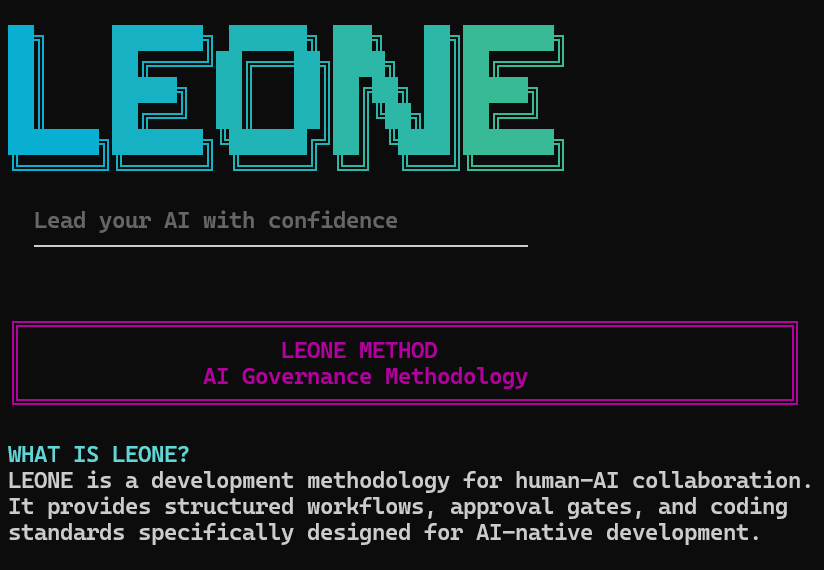

# LEONE CLI 🦁

> **Lead your AI with confidence**

Command Line Interface for installing and managing the LEONE AI Governance Methodology.

---

## 📸 Preview



---

## 📜 License & Copyright

**CLI Code:** MIT License — see [LICENSE-CODE](LICENSE-CODE)

**LEONE Methodology:** CC BY-SA 4.0 — see [LICENSE-METHODOLOGY](LICENSE-METHODOLOGY)

**Copyright:** © 2026 NETELITE. All rights reserved.

**LEONE** is a trademark of NETELITE.

---

### What CC BY-SA 4.0 Means:

✅ **You can:**
- Use LEONE for personal and commercial projects
- Modify and improve the methodology
- Create training courses based on LEONE
- Distribute your modifications

✅ **But you must:**
- Give credit to NETELITE
- Release modifications under the same CC BY-SA 4.0 license
- Not suggest NETELITE endorses you (without permission)

📖 Full license: https://creativecommons.org/licenses/by-sa/4.0/

## Installation

### Option 1: Install from NPM (Recommended)

```bash
# Install globally
npm install -g @netelite/leone-cli

# Now you can use 'leone' from anywhere
leone init
```

### Option 2: Install from Source

```bash
# Navigate to the CLI directory
cd leone-cli

# Link globally
npm link

# Or run directly
node index.js <command>
```

### Option 3: Run Without Installing

```bash
# Use npx to run without installing
npx @netelite/leone-cli init
```

---

## Usage

```bash
leone <command> [options]
```

### Commands

| Command | Description |
|---------|-------------|
| `init` | Install .leone/ AI Governance Methodology |
| `update` | Check and install updates |
| `about` | Show system information |
| `version` | Show CLI version |
| `help` | Show help message |

### Options

| Option | Description |
|--------|-------------|
| `--force, -f` | Overwrite existing .leone/ directory |
| `--help, -h` | Show help for specific command |
| `--version, -v` | Show version |

---

## Examples

```bash
# Install in current folder
leone init

# Overwrite existing installation
leone init --force

# Check for updates
leone update

# Learn about the system
leone about

# Show version
leone version
```

---

## Quick Start

```bash
# 1. Navigate to your project folder
cd your-project-folder

# 2. Install LEONE methodology
leone init

# 3. Open your AI assistant and start building!
```

---

## What is LEONE?

**LEONE** is a development methodology for human-AI collaboration.

- **Not a framework, tool, or platform**
- **A methodology** — a system of methods for achieving consistent, high-quality AI-assisted development

### Name & Origin

**LEONE** = LEO + NE

- **LEO** (Latin: Lion 🦁)
- **NE** (NETELITE) — The brand behind the methodology

Together: **LEONE** — "The Lion of NETELITE"

### Tagline

> "Lead your AI with confidence"

---

## File Structure

```
leone-cli/
├── index.js          # Main CLI entry point
├── package.json      # Package configuration
└── README.md         # This file
```

After running `leone init`, your project will have:

```
your-project/
└── .leone/
    ├── README.md              # Quick start guide
    ├── SYSTEM.md              # Operating principles
    ├── RULES.md               # Coding standards
    ├── WORKFLOW.md            # Feature development flow
    ├── STACK.md               # Tech stack (customizable)
    ├── SESSION_CONTEXT.md     # Session summary
    ├── AI_INSTRUCTIONS.md     # Tool usage guide
    ├── PROJECT_MAP.md         # File structure reference
    ├── VERSION                # Version file
    └── plans/
        ├── LIGHT.md           # Bug fixes
        ├── STANDARD.md        # Most features
        └── FULL.md            # Complex features
```

---

## 🔄 Session Flow (v1.0)



---

## Version History

| Version | Date | Changes |
|---------|------|---------|
| 1.0.0 | 2026-03-25 | Initial release |

---

## For Developers: Publishing to NPM

If you want to publish this CLI to npm:

```bash
# 1. Update version in package.json
npm version patch  # or minor/major

# 2. Test what will be published
npm pack

# 3. Login to npm (first time only)
npm login

# 4. Publish
npm publish

# 5. Install globally to test
npm install -g @netelite/leone-cli
leone version
```

---

## Requirements

- **Node.js:** >= 14.0.0
- **npm:** >= 6.0.0

---

## Support

- **Issues:** https://github.com/netelite/leone-cli/issues
- **Repository:** https://github.com/netelite/leone-cli
- **NPM:** https://www.npmjs.com/package/@netelite/leone-cli

---

## License

MIT © NETELITE

---

🦁 **Lead your AI with confidence**
